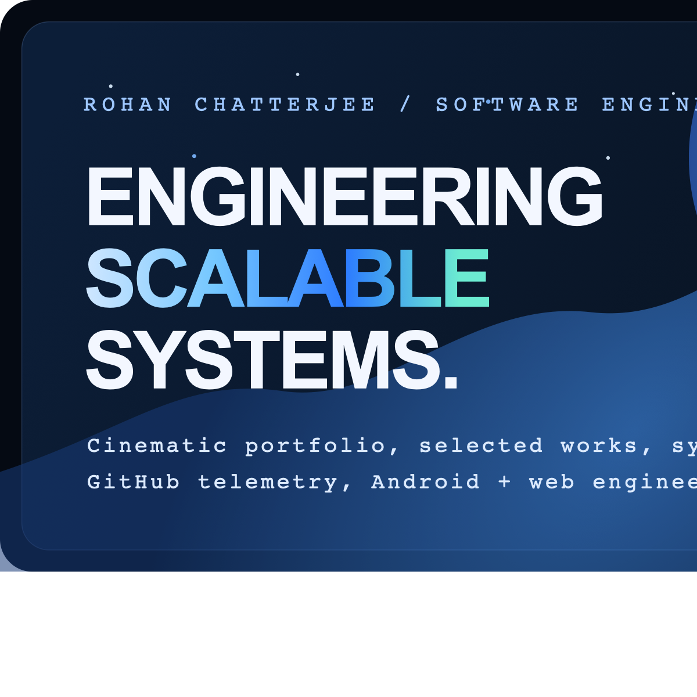

# Rohan Chatterjee Portfolio

Modern portfolio built with `Next.js`, `React`, and `TypeScript`, designed as a cinematic single-page experience with a custom hover-mask hero, themed visual system, live GitHub telemetry, and editorial case-study storytelling.



## Overview

This project is the codebase for Rohan Chatterjee's personal portfolio. It blends:

- a cinematic boot handoff
- a portrait-led interactive hero
- product-style project case studies
- an experience timeline
- a systems/process section
- live GitHub-backed proof and contribution telemetry
- a responsive contact close

The app is built on the Next.js App Router and rendered as a single landing page on `/`.

## Highlights

- Custom hero with dual cutout hover-reveal treatment and light/dark visual modes
- Editorial portfolio structure: `Hero / About / Experience / Work / Process / Proof / Contact`
- GitHub telemetry powered by a Next.js API route with caching
- Responsive mobile adaptations including disclosure-based layouts for heavier sections
- Metadata, Open Graph, Twitter cards, favicon, `robots.txt`, and `sitemap.xml`
- Motion and atmosphere designed to feel premium without turning the page into a noisy demo

## Tech Stack

- `Next.js 16`
- `React 18`
- `TypeScript`
- `Tailwind CSS`
- `Framer Motion`
- `GSAP`
- `Three.js`
- `Lucide React`
- `Radix UI`
- `Vitest`

## Project Structure

```text
.
├── public/
│   ├── logos/
│   ├── projects/
│   ├── og-image.png
│   ├── og-preview.png
│   ├── transparent1.png
│   ├── transparent2.png
│   └── Rohan_Chatterjee_Resume.pdf
├── src/
│   ├── app/
│   │   ├── api/portfolio/github/route.ts
│   │   ├── layout.tsx
│   │   └── page.tsx
│   ├── components/
│   │   ├── portfolio/
│   │   ├── ui/
│   │   ├── DeathStarScene.tsx
│   │   ├── KaliBootScreen.tsx
│   │   └── ParticleBackground.tsx
│   ├── data/
│   │   └── linkedin.ts
│   ├── features/
│   │   └── portfolio/content.ts
│   ├── lib/
│   │   └── utils.ts
│   ├── App.tsx
│   ├── App.css
│   └── index.css
├── package.json
└── README.md
```

## Key Files

- [src/app/layout.tsx](/Users/rohanc/Downloads/portfolio/src/app/layout.tsx:1)
  Defines global metadata, Open Graph tags, Twitter cards, icons, and robots behavior.

- [src/app/page.tsx](/Users/rohanc/Downloads/portfolio/src/app/page.tsx:1)
  App Router entrypoint for the landing page.

- [src/App.tsx](/Users/rohanc/Downloads/portfolio/src/App.tsx:1)
  Composition root that assembles the full portfolio experience.

- [src/features/portfolio/content.ts](/Users/rohanc/Downloads/portfolio/src/features/portfolio/content.ts:1)
  Central content source for hero copy, featured projects, skills, contact links, writing notes, and proof signals.

- [src/components/portfolio/usePortfolioData.ts](/Users/rohanc/Downloads/portfolio/src/components/portfolio/usePortfolioData.ts:1)
  Shapes live GitHub data into portfolio-friendly sections such as contribution grids, stats, and project showcase content.

- [src/app/api/portfolio/github/route.ts](/Users/rohanc/Downloads/portfolio/src/app/api/portfolio/github/route.ts:1)
  Server route that fetches GitHub profile, repositories, and contribution data with caching.

## Design System Notes

The current portfolio is not a generic template. It intentionally uses:

- strong typographic contrast
- branded light/dark presentation modes
- custom motion wrappers and atmospheric backgrounds
- disclosure-based mobile patterns for dense sections
- section-driven storytelling instead of a resume dump

The hero remains the visual peak, while lower sections use quieter motion and structure so the page stays readable.

## Getting Started

### Prerequisites

- `Node.js 18+`
- `npm`

### Install dependencies

```bash
npm install
```

### Start development

```bash
npm run dev
```

### Production build

```bash
npm run build
```

### Run production server

```bash
npm run start
```

## Available Scripts

- `npm run dev` — starts the Next.js dev server
- `npm run build` — creates a production build
- `npm run start` — serves the production build
- `npm run lint` — runs ESLint
- `npm run test` — runs the Vitest suite once
- `npm run test:watch` — runs Vitest in watch mode

## Data + Content Flow

### Static content

Portfolio copy, featured project narratives, contact links, skills, and signal blocks are defined in:

- [src/features/portfolio/content.ts](/Users/rohanc/Downloads/portfolio/src/features/portfolio/content.ts:1)
- [src/data/linkedin.ts](/Users/rohanc/Downloads/portfolio/src/data/linkedin.ts:1)

### Live content

GitHub-related telemetry is fetched through:

- [src/app/api/portfolio/github/route.ts](/Users/rohanc/Downloads/portfolio/src/app/api/portfolio/github/route.ts:1)

That route:

- fetches public GitHub profile data
- fetches repositories
- fetches yearly contribution data
- returns a normalized JSON payload for the frontend
- uses cache headers and `revalidate` to avoid unnecessary fetch churn

## Assets

The `public/` directory contains the primary portfolio assets:

- hero cutouts
- project header art
- logos
- preview images
- favicon assets
- resume PDF

Some legacy or experimental components are still kept in the repo for future reuse, including:

- [src/components/DeathStarScene.tsx](/Users/rohanc/Downloads/portfolio/src/components/DeathStarScene.tsx:1)
- [src/components/ParticleBackground.tsx](/Users/rohanc/Downloads/portfolio/src/components/ParticleBackground.tsx:1)

They are part of the project history and design exploration, even when not central to the current landing flow.

## SEO + Metadata

This repo already includes:

- canonical metadata
- Open Graph image support
- Twitter summary card support
- favicon wiring
- `robots.txt`
- `sitemap.xml`

The primary OG image is:

- `public/og-image.png`

## Deployment

The project is deployment-ready for platforms that support Next.js App Router, including Vercel.

Current metadata assumes the public production base URL:

- [https://rochiee24.vercel.app](https://rochiee24.vercel.app)

If the deployment domain changes, update:

- `metadataBase`
- `openGraph.url`
- `twitter.images` if needed

inside [src/app/layout.tsx](/Users/rohanc/Downloads/portfolio/src/app/layout.tsx:1).

## Philosophy

This codebase is meant to present engineering taste as much as engineering output.

The goal is not just to list projects, but to communicate:

- systems thinking
- product judgment
- interface craft
- maintainable execution
- technical clarity under real constraints

## Author

**Rohan Chatterjee**

- GitHub: [@InsaneCoder789](https://github.com/InsaneCoder789)
- LinkedIn: [rochiee24](https://linkedin.com/in/rochiee24)
- Instagram: [@rochiee24](https://instagram.com/rochiee24)
- Email: [chatterjeerohan0204@gmail.com](mailto:chatterjeerohan0204@gmail.com)
